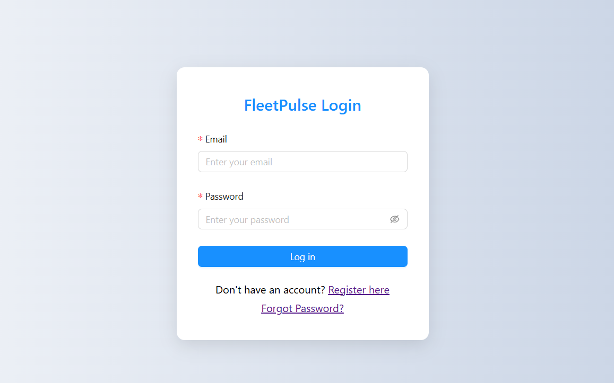
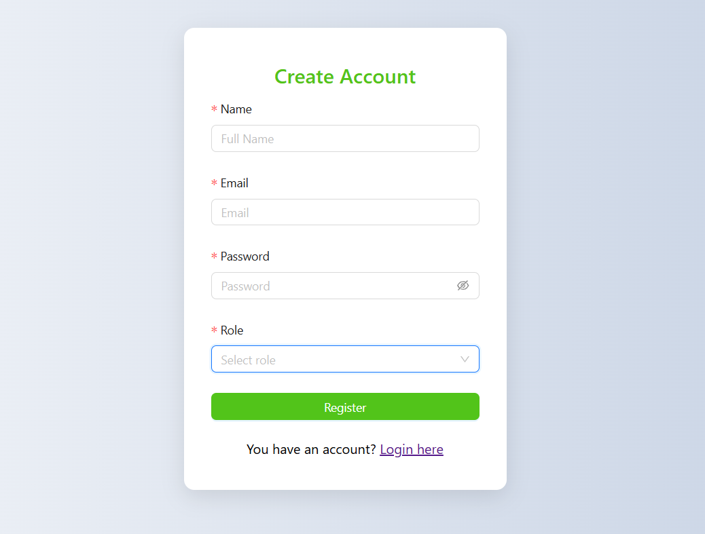
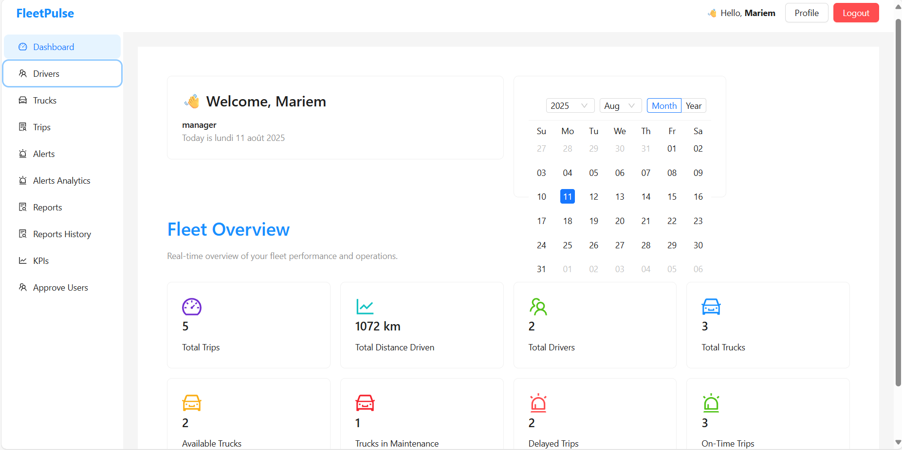
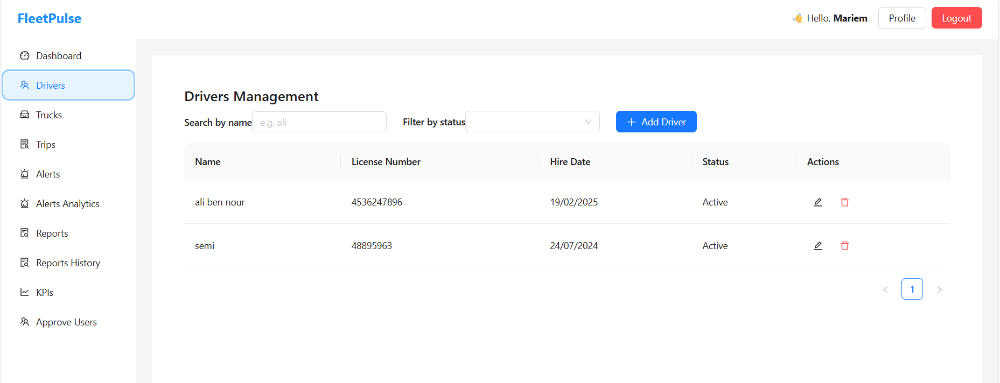
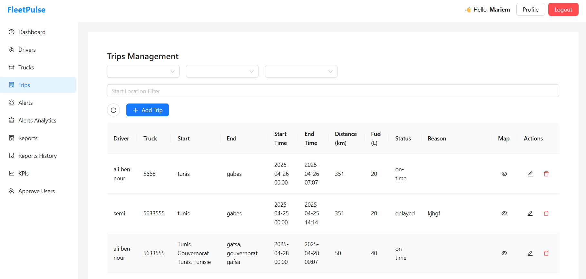
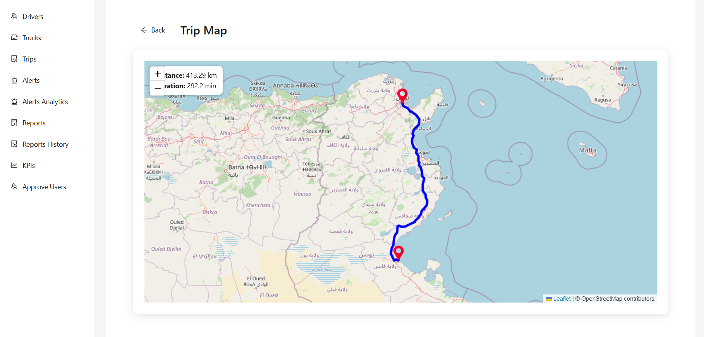
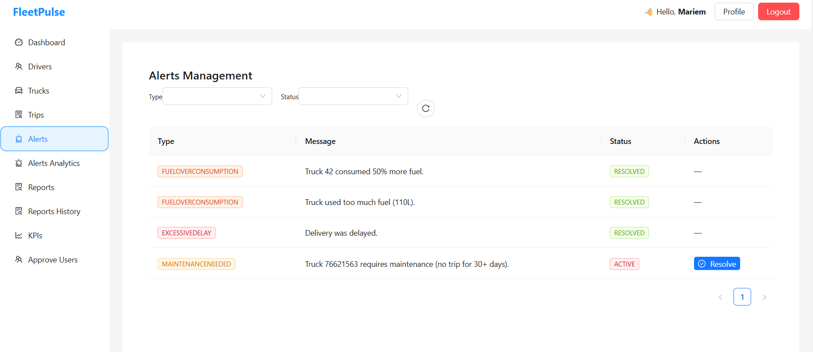
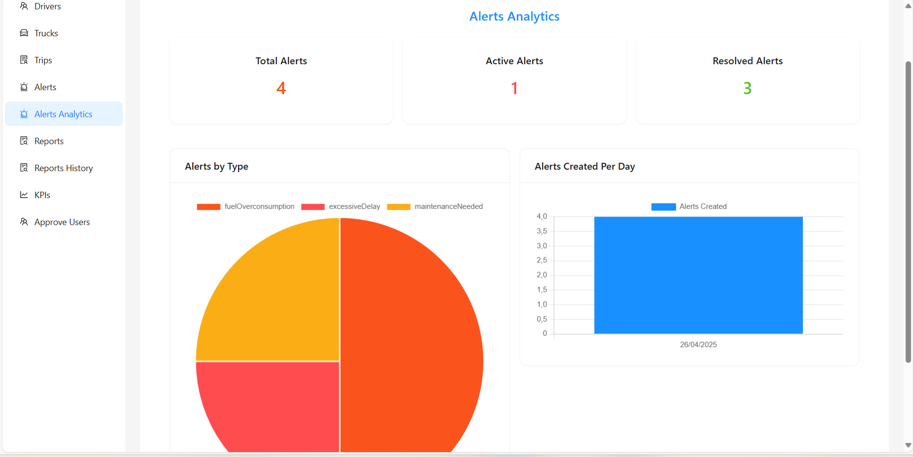
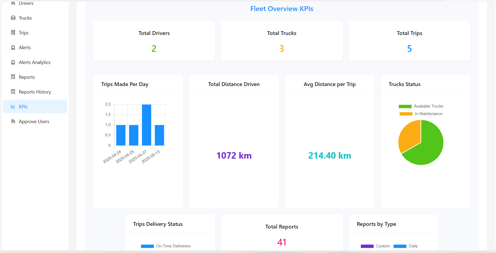
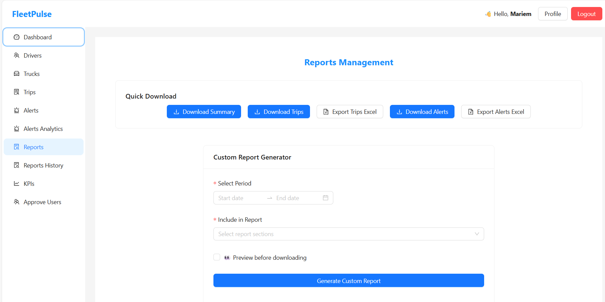

# 🚚 FleetTrack Dashboard (FleetPulse) – MERN Project

FleetPulse is a **web-based fleet management and analytics dashboard** designed for trucking and logistics companies.  
It provides **real-time insights** into fleet performance, fuel usage, trip efficiency, delivery delays, and alerts.  
The platform also supports **report generation**, **KPI tracking**, **driver and vehicle management**, and **role-based access control**.

Built using the **MERN Stack** (**MongoDB**, **Express.js**, **React**, **Node.js**), FleetPulse empowers **managers, supervisors, logistics operators, and company owners** to make data-driven decisions that improve operational efficiency.

---

## 📑 Table of Contents

- [Features](#features)
- [Installation](#installation)
- [Configuration](#configuration)
- [Usage](#usage)
- [Project Structure](#project-structure)
- [Technologies Used](#technologies-used)
- [Screenshots](#screenshots)

---

## ✨ Features

- **🔐 Authentication & Role-Based Access Control**  
  Secure login with different roles: Manager, Supervisor, Logistics Operator, Company Owner.

- **📊 Dashboard**  
  Real-time overview of fleet KPIs, fuel usage, trip status, and alerts.

- **👥 Driver Management**  
  Add, update, and monitor drivers with relevant details.

- **🚛 Truck Management**  
  Assign, maintain, and track vehicles (trucks) in the fleet.

- **🛣 Trip Management**  
  Create, edit, and monitor ongoing and completed trips.

- **⚠ Alerts System**  
  Generate and track alerts related to fleet incidents or maintenance needs.

- **📉 Alerts Analytics**  
  Analyze trends and statistics for generated alerts.

- **📑 Reports & History**  
  Create, export, and view historical reports for operational insights.

- **📈 KPI Tracking**  
  Monitor key performance indicators to improve fleet efficiency.

- **📝 User Approval System**  
  Managers can approve or reject new user accounts.

- **🔔 Real-Time Notifications**  
  Instant updates for alerts, trips, and approvals.

## 📸 Screenshots

### Login



### Registre



### Dashboard



### Driver Management



### Trip Management



### Trip Map



### Alerts



### Alerts Analytic



### KPI Page



### Reports Management

## 

## ⚙ Installation

### Prerequisites

- **Node.js** (v14+ recommended)
- **MongoDB** (v4+)
- **npm** or **yarn**

### Steps

1. **Clone the repository**
   ```bash
   git clone https://github.com/MariemSoualhia/FleetTrack-Dashboard-MernProject.git
   ```
2. Install dependencies

   Backend

   ```
   cd backend
   npm install
   ```

   Frontend

   ```
   cd ../frontend
   npm install
   ```

## ⚙ Configuration

Create a .env file inside the backend folder with the following variables:

```
MONGO_URI=mongodb://127.0.0.1:27017/fleetpulse
PORT=5000
JWT_SECRET=123456789JTW
email=**********@gmail.com
password=**************************
```

### 🚀 Usage

1. Start the backend server

```
cd backend
npm strat
```

2. Start the frontend app

```
cd ../frontend
npm start

```

By default, the backend runs on http://localhost:5000 and the frontend on http://localhost:3000.
